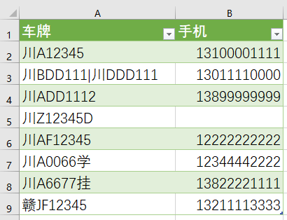

# 车牌和手机号提取

目的: 从消息记录中提取每条消息中的车牌号和手机号

**前提: 车牌号和手机号必须包含在同一行消息中**

## 使用方法

有两种用法:

1. 转换已保存为文件的消息记录: 
   1. 或直接双击程序: 将程序文件位置的当天日期的文件(`0221.txt`)提取后保存为 Excel 格式(`0221.txt.csv`)
   2. 或命令行运行: `car-info.exe 0220.txt 0221.txt`, 可同时提取多个文件, 保存结果为: `0220.txt.csv`
2. 浏览器在线提取: 
   1. 或双击 `car-info-web.bat` 启动 Web 服务后, 浏览器打开: `http://127.0.0.1:16888`
   2. 或命令行运行 `car-info.exe web` 启动 Web 服务

## 一. 转换文件示例

### 1. 复制消息到文件

复制 `QQ`, `微信`, `钉钉` 消息记录到日期命名(月日)的 `txt` 文件, 如: `0221.txt`

见 `demo/0221.txt`

**特别注意: 保存文件时必须选择 `UTF-8` 编码格式**


### 2. 双击程序


得到结果 `demo/0221.txt.csv`, 双击文件用 Excel 打开即可:



### 3. 指定待提取的文件

#### a. 指定文件名

若要提取指定消息记录文件, 可以在命令行(运行 - `cmd`)进入程序文件夹, 输入命令:

```powershell
car-info.exe my.msg.file.txt 2.txt 3.txt
```

可以同时提取多个文件, 结果将保存在第一个文件命名的 `csv` 文件中, 即: `my.msg.file.txt.csv`


#### b. 快捷指定日期

也可以使用快捷方式提取昨天, 前天的消息文件, 参数为整数:

`-1` 表示当前日期减一天, 即昨天, 即文件名: `0220.txt`

可以做几个常用的批处理方便使用, 如: 双击 `yesterday.bat` 则提取昨天的消息文件

示例: 提取昨天和前天的消息记录

```powershell
car-info.exe -1 -2
```


## 二. 浏览器在线提取示例

### 1. 启动网站服务

双击 `demo/car-info-web.bat`


若弹出防火墙, 选择允许, 如图:


### 2. 打开浏览器

访问: `http://127.0.0.1:16888`

其他人也可以访问你的网站服务, 假如你的 IP 是: `192.168.1.100`, 则可以访问: `http://192.168.1.100:16888`


*ff*

